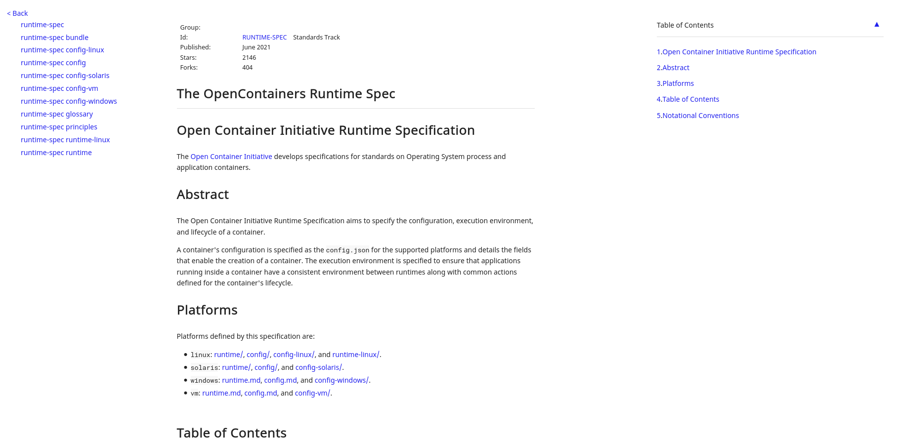

# Request for Change (RFC) Jekyll Theme

**⭐️ Welcome to RFC Jekyll! ⭐️**



This is a template to help you render an RFC document (or other standards document)
on GitHub pages assembled from markdown files in multiple repositories. As a stong
example of this secnario, we render it here with the [opencontainers](https://github.com/opencontainers)
specs. Notably:

1. You can combine many different resources across multiple repos to look like one holistic documentation base
2. Content is retrieved dynamically directly from the specs and you don't need to rebuild.
3. Adding new pages comes down to adding metadata for the pages you want.

## Usage

### 1. Get the code

You can clone the repository right to where you want to host the docs:

```bash
git clone https://github.com/vsoch/rcf-jekyll ./docs
cd docs
```

### 2. Customize

#### Jekyll Config

To edit configuration values, customize the [_config.yml](https://github.com/vsoch/rfc-jekyll/blob/master/_config.yml).
This includes details like the site title and basename.

#### How are documents defined?

The [pages](pages) folder contains subfolders that are each examples of specs.
For example, [pages/images-spec](pages/image-spec) includes multiple markdown
files that are rendered from [opencontainers/image-spec](https://github.com/opencontainers/image-spec).

##### 1. Document Metadata

The [_data/specs.yaml](_data/specs.yaml) file defines shared attributes for an
entire spec folder. For example, let's take a look at this data file's definition
for `image-spec`:

```yaml
# This file holds shared metadata for a directory of specs
image-spec:
  name: Image Spec
  slug: image-spec
  group: Open Containers Initiative (OCI)
  raw_url: https://raw.githubusercontent.com/opencontainers/image-spec/master
  github_repo: opencontainers/image-spec
  github_url: https://github.com/opencontainers/image-spec/blob/master

  # Courtesy list of pages relative to site root to link
  pages:
   - image-spec/
   - image-spec/annotations/
   - image-spec/config/
   - image-spec/considerations/
   - image-spec/conversions/
   - image-spec/descriptor/
   - image-spec/image-index/
   - image-spec/image-layout/
   - image-spec/layer/
   - image-spec/manifest/
   - image-spec/media-types/
```

The various urls are used to define relative paths in the repository. The list
of pages (optional) will render a left side navigation to give the reader
context of all the documents included for a spec. Importantly, the key `image-spec`
at the top is used to lookup this metadata.

##### 2. Document Index Page

Now we can look at an `index.md`
in [pages/image-spec/index.md](pages/image-spec/index.md) that is considered the
root of a spec:

```yaml
---
layout: page
title: The OpenContainers Image Spec
id: IMAGE-SPEC
permalink: /image-spec/
spec: spec.md
# data key from _data/specs.yaml
key: image-spec
---
```

Note the key `image-spec` will be used for the lookup. We primarily need to know
the name of the markdown file that will render into the page (`spec.md`) and then
custom, page-specific attributes like the permalink and title.

##### 3. Document Additional Pages

Now let's say that we have a second markdown file linked from this spec called `manifest.md`.
The template will find these links and render them into relative urls, so we also add
pages for them. In the case of `manifest.md` the metadata would be almost the same, 
but we'd update the name of the spec from `spec.md` to `manifest.md` and **important**
we would have the permalink be a relative path to it's parent, image spec:

```yaml
---
layout: page
title: The OpenContainers Image Manifest Spec
id: IMAGE-SPEC-MANIFEST
permalink: /image-spec/manifest/
spec: manifest.md
parent: image-spec
key: image-spec
---
```

You'll notice a new field - **parent**. This is here so that we can correctly
format links in the correct namespace. The reason for this metadata is because we render the pages doing the following:

1. Retrieve raw markdown text from the `raw_url` + `/` + `spec`
2. For each image tag we find, if the url is relative, we add the `raw_url` so the image renders.
3. For each link that we find with a markdown file (that is not linked to another repository) we remove the `.md` extension and turn it into a path. This means that the final url looks like a relative path of the filename. (E.g., manifest.md linked relatively turns into `manifest/` linked from the current page, or `/image-spec/manifest/`.


#### How do I add a new document?

Thus, to add a new document you should:

1. Add an entry to [_data/specs.yaml](_data/specs.yaml)
2. Add a new subfolder in [pages](pages)
3. Create an index.md within using the metadata examples above. The permalink of the index should reference the root.
4. Markdown files linked from that page should be added with a permalink relative to the index, and a parent of the root.

This means that when adding a new spec, you will need to do work once to go through these steps,
but then you never need to update it again. The spec will load dynamically whenever the site is needed,
and there is no rebuild necessary. 

#### How do I get help?

If you want to add a new OCI document and are having trouble, please [open an issue](https://github.com/vsoch/rfc-jekyll/issues)
to request it to be added.

### 3. Serve

Depending on how you installed jekyll:

```bash
jekyll serve
# or
bundle exec jekyll serve
```
